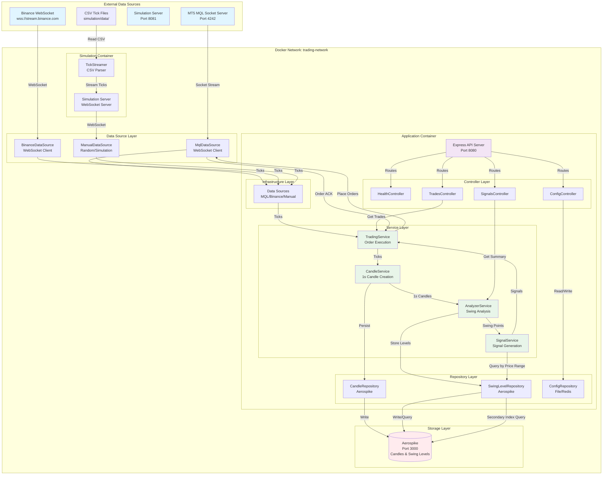

# Application Architecture & Data Flow

## Complete Infrastructure Diagram



## Detailed Data Flow

### 1. Tick Ingestion Flow

```
External Source → DataSource → TradingService → CandleService
                                    ↓
                              AnalyzerService
```

**Steps:**
1. External source (MQL/Binance/Simulation) sends ticks
2. DataSource receives and standardizes tick format
3. TradingService routes ticks to CandleService
4. CandleService aggregates ticks into 1-second candles
5. Candles are stored in memory (ring buffer) and persisted to Aerospike

### 2. Analysis Flow

```
CandleService → AnalyzerService → MultiTimeframeAnalyzer → SwingAnalyzer
                    ↓
              SwingLevelRepository → Aerospike
```

**Steps:**
1. CandleService emits `candleStored` event
2. AnalyzerService triggers analysis (debounced)
3. Aggregates 1s candles into 1m, 3m, 5m timeframes
4. Detects swing points on each timeframe
5. Finds common swing points across timeframes
6. Stores qualified swing levels in Aerospike with price index

### 3. Signal Generation Flow

```
CandleService → AnalyzerService → SignalService
                    ↓
              SwingLevelRepository (Price Range Query)
                    ↓
              Aerospike (Secondary Index)
```

**Steps:**
1. On each stored candle, AnalyzerService checks for signals (parallel to analysis)
2. Queries SwingLevelRepository for levels in price range (current price ± tolerance)
3. SignalService compares current price with relevant swing levels
4. Generates BUY/SELL signals when price revisits swing levels
5. Signals are saved to CSV and emitted to TradingService

### 4. Order Execution Flow

```
SignalService → TradingService → MqlDataSource → MT5 MQL Server
                                      ↓
                                Order ACK → TradingService
```

**Steps:**
1. SignalService emits signal event
2. TradingService receives signal and checks auto-trade settings
3. If enabled, constructs order payload (type, volume, SL, TP)
4. Sends order to MqlDataSource
5. MqlDataSource forwards to MT5 MQL server via socket
6. Receives order acknowledgment and trade updates

### 5. Simulation Flow

```
CSV File → TickStreamer → Simulation Server → ManualDataSource
                              ↓
                        WebSocket Stream
```

**Steps:**
1. TickStreamer reads CSV file and parses ticks
2. Simulation Server loads ticks into memory
3. On client connection, streams ticks via WebSocket
4. ManualDataSource connects to simulation server
5. Receives ticks and emits them using standard tick format
6. Ticks flow through normal processing pipeline

## Component Responsibilities

### Infrastructure Layer
- **Data Sources**: Connect to external tick sources, standardize tick format
- **Storage Clients**: Manage connections to Aerospike, Redis

### Service Layer
- **TradingService**: Orchestrates tick flow, executes orders, manages trades
- **CandleService**: Creates 1-second candles from ticks, manages ring buffer
- **AnalyzerService**: Coordinates multi-timeframe analysis, triggers signal checks
- **SignalService**: Generates trading signals from swing level revisits

### Repository Layer
- **CandleRepository**: Persists candles to Aerospike, retrieves recent candles
- **SwingLevelRepository**: Stores swing levels, queries by price range using secondary index
- **ConfigRepository**: Manages symbol settings (SL/TP/Volume)

### Controller Layer
- **HealthController**: System health and status
- **ConfigController**: Symbol configuration management
- **TradesController**: Open trades and trade history
- **SignalsController**: Signal summaries

## Storage Architecture

### Aerospike Namespaces

**candles** namespace:
- Stores 1-second OHLCV candles
- Key: `{symbol}_candles::{timestamp}`
- TTL: 7 days
- Used for: Historical candle retrieval, analysis

**swing_levels** namespace:
- Stores qualified swing levels
- Key: `levels::{symbol}_{levelKey}`
- Secondary index on `price` bin for range queries
- TTL: 0 (persistent)
- Used for: Signal generation via price-range queries

## Network Topology

```
┌─────────────────────────────────────────────────────────┐
│              Docker Network: trading-network             │
│                                                           │
│  ┌──────────────┐  ┌──────────────┐  ┌──────────────┐  │
│  │   Aerospike  │  │     App      │  │  Simulation  │  │
│  │   :3000      │  │   :8080      │  │   :8081      │  │
│  └──────────────┘  └──────────────┘  └──────────────┘  │
│                                                           │
└─────────────────────────────────────────────────────────┘
         ↑                    ↑                    ↑
         │                    │                    │
    Storage            API/WebSocket         WebSocket
```

## Data Flow Summary

1. **Tick → Candle**: Real-time tick aggregation into 1-second candles
2. **Candle → Analysis**: Multi-timeframe swing point detection
3. **Analysis → Storage**: Qualified swing levels persisted with price index
4. **Price → Signal**: Real-time signal generation using price-range queries
5. **Signal → Order**: Automated order execution via MQL API
6. **Order → Trade**: Trade lifecycle management and tracking
